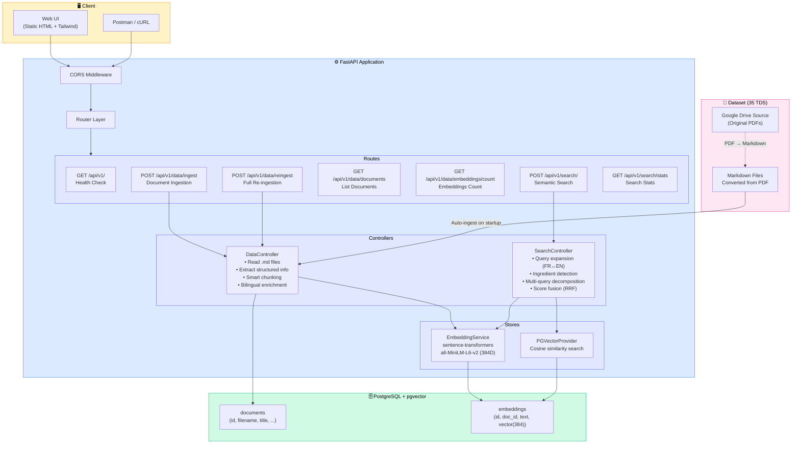
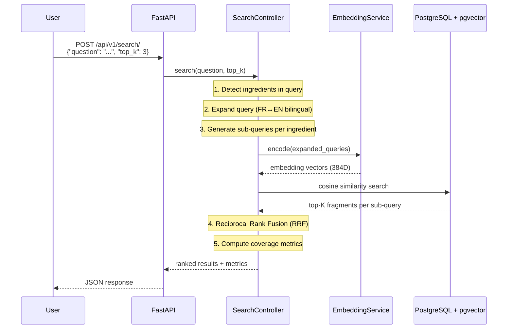
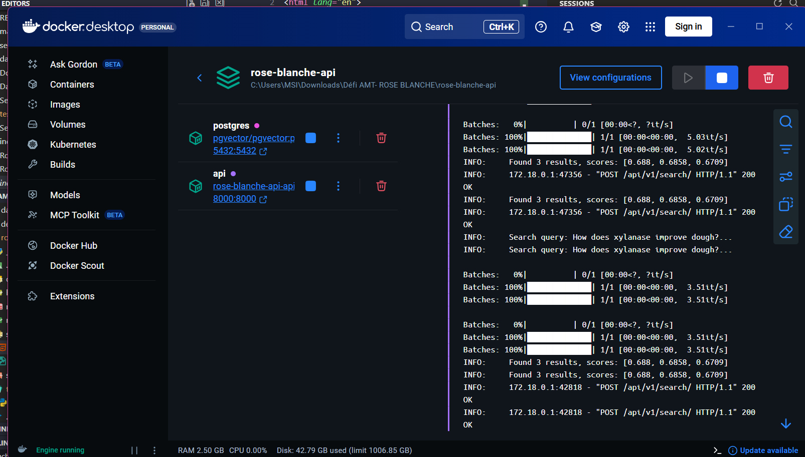
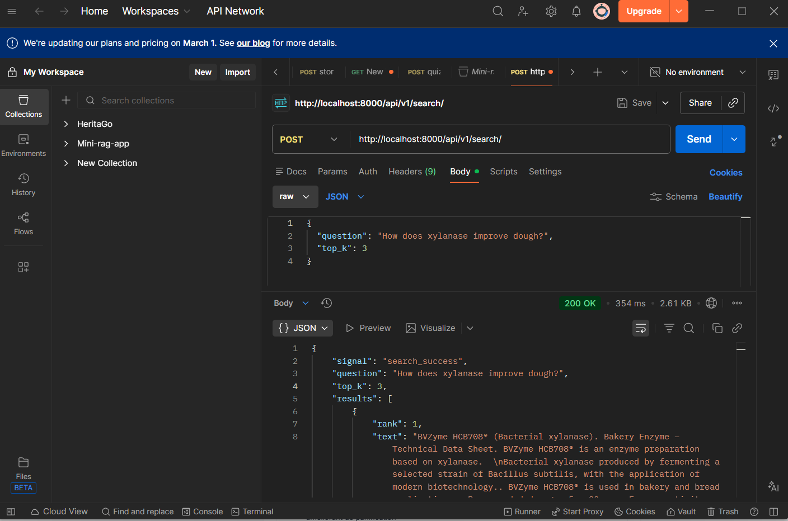

<p align="center">
  
</p>

<h1 align="center">🌹 Rose Blanche — RAG Semantic Search API</h1>

<p align="center">
  <strong>Défi AMT — Bakery & Pastry Formulation Assistant</strong><br/>
  Retrieval-Augmented Generation module for intelligent enzyme dosage retrieval
</p>

<p align="center">
  
  
  
  
  
  
</p>

---

## 📖 About

**Rose Blanche RAG API** is a semantic search engine built for the **AMT (Agro-Mediterranean Technologies)** challenge. It helps bakery and pastry professionals find recommended enzyme dosages, product specifications, and formulation guidance from **BVZyme** technical data sheets.

The system ingests **35 technical data sheets** (TDS) covering bakery enzymes (alpha-amylase, xylanase, lipase, transglutaminase, glucose oxidase, amyloglucosidase, maltogenic amylase) and ascorbic acid, then answers formulation questions via **cosine similarity** search on dense vector embeddings.

### Challenge Question

> *"Quelles sont les quantités recommandées d'acide ascorbique, d'alpha-amylase et de xylanase pour l'amélioration de la panification ?"*

---

## 🎬 Demo

<p align="center">
  
</p>

---

## 🏗️ Architecture



### Data Flow



---

## 📊 Technical Specifications

| Parameter | Value |
|---|---|
| **Embedding Model** | `all-MiniLM-L6-v2` |
| **Library** | `sentence-transformers` |
| **Vector Dimension** | 384 |
| **Similarity Metric** | Cosine Similarity |
| **Default Top-K** | 3 |
| **Database** | PostgreSQL 17 + pgvector |
| **Chunking** | Smart structured extraction + overlap |
| **Default Chunk Size** | 500 characters |
| **Default Overlap** | 50 characters |
| **Query Expansion** | French ↔ English bilingual |
| **Score Fusion** | Reciprocal Rank Fusion (RRF) |

---

## 📁 Dataset

The dataset consists of **35 Technical Data Sheets (TDS)** from **BVZyme** enzyme products, originally in PDF format.

🔗 **Original Source:** [Google Drive — BVZyme TDS Collection](https://drive.google.com/drive/folders/10nR80LKvyVeTyE8qD8bBi1MPdgvmvLMJ)

The PDFs were converted to **Markdown** for structured extraction and are stored in the [`dataset/`](dataset/) folder.

### Covered Products

| Enzyme Type | Products | Dosage Range |
|---|---|---|
| **Ascorbic Acid** (E300) | Acide Ascorbique | 20–300 ppm |
| **Alpha-Amylase** (Fungal) | AF110, AF220, AF330, AF SX | 2–25 ppm |
| **Maltogenic Amylase** | A FRESH101/202/303, A SOFT205/305/405 | 10–100 ppm |
| **Glucose Oxidase** | GOX 110, GO MAX 63/65 | 5–50 ppm |
| **Lipase** | L MAX X/63/64/65, L55, L65 | 2–60 ppm |
| **Transglutaminase** | TG881, TG883, TG MAX63/64 | 5–40 ppm |
| **Xylanase** (Bacterial) | HCB708, HCB709, HCB710 | 5–30 ppm |
| **Xylanase** (Fungal) | HCF400/500/600, HCF MAX X/63/64 | 0.5–70 ppm |
| **Amyloglucosidase** | AMG880, AMG1400 | 10–100 ppm |

---

## 🐳 Docker Deployment

The entire stack runs with a single command using Docker Compose.

### Docker Containers

<p align="center">
  
</p>

### Quick Start

```bash
# Clone the repository
git clone https://github.com/MarouaHattab/Log-Analysis-RAG.git
cd Log-Analysis-RAG

# Start all services (PostgreSQL + API)
cd rose-blanche-api
docker compose up --build -d
```

The API will be available at **http://localhost:8000** and the dataset is **automatically ingested on startup**.

### Services

| Container | Image | Port | Description |
|---|---|---|---|
| `rose-blanche-db` | `pgvector/pgvector:pg17` | 5432 | PostgreSQL with pgvector extension |
| `rose-blanche-api` | Custom (Python 3.11) | 8000 | FastAPI backend + embedded model |

### Environment Variables

| Variable | Default | Description |
|---|---|---|
| `POSTGRES_USERNAME` | `postgres` | Database username |
| `POSTGRES_PASSWORD` | `admin` | Database password |
| `POSTGRES_HOST` | `postgres` | Database host (Docker service name) |
| `POSTGRES_PORT` | `5432` | Database port |
| `POSTGRES_MAIN_DATABASE` | `rose_blanche` | Database name |
| `EMBEDDING_MODEL_ID` | `all-MiniLM-L6-v2` | Sentence-transformers model |
| `EMBEDDING_MODEL_SIZE` | `384` | Embedding vector dimension |
| `VECTOR_DB_DISTANCE_METHOD` | `cosine` | Similarity metric |
| `DEFAULT_CHUNK_SIZE` | `500` | Text chunk size (characters) |
| `DEFAULT_OVERLAP_SIZE` | `50` | Overlap between chunks |
| `DEFAULT_TOP_K` | `3` | Default number of results |
| `AUTO_INGEST` | `true` | Auto-ingest dataset on startup |

---

## 🔌 API Endpoints

### Health Check

```http
GET /api/v1/
```

Returns API metadata (app name, version, model info, top_k).

### Data Ingestion

```http
POST /api/v1/data/ingest
Content-Type: application/json

{
  "chunk_size": 500,
  "overlap_size": 50
}
```

Reads all `.md` files from the dataset directory, chunks them, generates embeddings, and stores them in PostgreSQL.

### Re-Ingest (Full Reset)

```http
POST /api/v1/data/reingest
Content-Type: application/json

{}
```

Drops all existing data and re-ingests from scratch.

### List Documents

```http
GET /api/v1/data/documents
```

Returns all ingested documents with metadata.

### Embeddings Count

```http
GET /api/v1/data/embeddings/count
```

### Semantic Search (Main Endpoint)

```http
POST /api/v1/search/
Content-Type: application/json

{
  "question": "Quelles sont les quantités recommandées d'acide ascorbique, d'alpha-amylase et de xylanase pour l'amélioration de la panification ?",
  "top_k": 3
}
```

**Response:**

```json
{
  "signal": "search_success",
  "question": "...",
  "top_k": 3,
  "results": [
    { "rank": 1, "text": "...", "score": 0.91, "document_id": 1 },
    { "rank": 2, "text": "...", "score": 0.87, "document_id": 2 },
    { "rank": 3, "text": "...", "score": 0.82, "document_id": 3 }
  ],
  "metrics": {
    "average_score": 0.8667,
    "min_score": 0.82,
    "max_score": 0.91,
    "unique_documents": 3,
    "total_results": 3,
    "detected_ingredients": ["ascorbic acid", "alpha-amylase", "xylanase"],
    "ingredient_coverage": 1.0,
    "coverage_detail": "3/3 ingredients found in results"
  }
}
```

### Search Stats

```http
GET /api/v1/search/stats
```

---

## 🧪 Postman Tests

A complete Postman collection is provided to test all API endpoints.

### Import the Collection

1. Open **Postman**
2. Click **Import** → select [`postman/Rose-Blanche-RAG-API.postman_collection.json`](rose-blanche-api/postman/Rose-Blanche-RAG-API.postman_collection.json)
3. The collection variable `{{base_url}}` defaults to `http://localhost:8000`

### Test Coverage

| Folder | Tests | Description |
|---|---|---|
| **Health & Info** | 1 | Welcome endpoint, model validation |
| **Data Ingestion** | 5 | Ingest, re-ingest, list docs, embeddings count |
| **Semantic Search** | 8 | Challenge questions (FR/EN), single ingredients, multi-ingredient |
| **Search Statistics** | 1 | Model info, dimension, similarity method |

### Test Captures

<p align="center">
  
</p>

Each test request includes **automated assertions** that verify:
- ✅ HTTP status codes (200)
- ✅ Response signal values (`search_success`, `ingestion_success`)
- ✅ Result count matches `top_k`
- ✅ Relevance scores above threshold
- ✅ Ingredient detection and coverage
- ✅ Correct model and dimension metadata

---

## 📂 Project Structure

```
.
├── dataset/                          # 35 Markdown TDS files (converted from PDF)
│   ├── acide ascorbique.md
│   ├── BVZyme TDS AF110.md
│   ├── BVZyme TDS A FRESH101.md
│   ├── TDS BVzyme HCF MAX63.md
│   └── ... (35 files total)
│
├── demo/                             # Demo assets
│   ├── demo.gif                      # Application demo recording
│   ├── docker.png                    # Docker containers screenshot
│   ├── postman-test.png              # Postman test results screenshot
│   └── images (4).png               # Project logo
│
├── rose-blanche-api/                 # FastAPI application
│   ├── main.py                       # App entry point + startup/shutdown
│   ├── Dockerfile                    # Multi-stage Docker build
│   ├── docker-compose.yml            # PostgreSQL + API stack
│   ├── requirements.txt              # Python dependencies
│   │
│   ├── controllers/
│   │   ├── BaseController.py         # Base controller class
│   │   ├── DataController.py         # Ingestion: read MD → chunk → embed → store
│   │   └── SearchController.py       # Search: query expansion → embed → cosine → RRF
│   │
│   ├── helpers/
│   │   └── config.py                 # Pydantic settings (env-based config)
│   │
│   ├── models/
│   │   ├── BaseDataModel.py          # Base async model
│   │   ├── DocumentModel.py          # CRUD for documents table
│   │   ├── EmbeddingModel.py         # CRUD for embeddings table
│   │   ├── db_schemes/
│   │   │   ├── base.py               # SQLAlchemy declarative base
│   │   │   └── schemes.py            # Document, Embedding, RetrievedFragment
│   │   └── enums/
│   │       └── ResponseEnums.py      # API response signals
│   │
│   ├── routes/
│   │   ├── base.py                   # GET /api/v1/
│   │   ├── data.py                   # POST ingest, GET documents
│   │   ├── search.py                 # POST search/, GET stats
│   │   └── schemes/
│   │       └── search.py             # Pydantic request models
│   │
│   ├── stores/
│   │   ├── embedding/
│   │   │   └── EmbeddingService.py   # sentence-transformers wrapper
│   │   └── vectordb/
│   │       ├── PGVectorProvider.py   # pgvector cosine search
│   │       └── VectorDBEnums.py      # Distance method enums
│   │
│   ├── static/
│   │   └── index.html                # Web UI (Tailwind CSS)
│   │
│   ├── postman/
│   │   └── Rose-Blanche-RAG-API.postman_collection.json
│   │
│   └── tests/
│       └── test_search_accuracy.py   # Automated accuracy tests
│
└── README.md                         # This file
```

---

## ⚙️ Local Development (Without Docker)

```bash
# 1. Create virtual environment
python -m venv .venv
.venv\Scripts\activate        # Windows
# source .venv/bin/activate   # Linux/macOS

# 2. Install dependencies
cd rose-blanche-api
pip install -r requirements.txt

# 3. Start PostgreSQL with pgvector
# Make sure PostgreSQL is running with the pgvector extension installed

# 4. Configure environment
# Create a .env file or set environment variables (see table above)

# 5. Start the server
uvicorn main:app --reload --host 0.0.0.0 --port 8000
```

Open **http://localhost:8000** to access the Web UI, or **http://localhost:8000/docs** for the interactive Swagger documentation.

---

## 🔍 How It Works

### 1. Data Ingestion Pipeline

```
PDF (Google Drive) → Markdown → Structured Extraction → Smart Chunking → Embedding → pgvector
```

- **Structured extraction** pulls product name, enzyme type, activity, dosage, application, storage info
- **Bilingual enrichment** adds French ↔ English synonyms to improve cross-language retrieval
- **Smart chunking** creates semantic chunks with configurable size and overlap

### 2. Search Pipeline

```
User Question → Ingredient Detection → Query Expansion (FR↔EN) → Multi-Query Decomposition → Embedding → Cosine Similarity → RRF Fusion → Ranked Results
```

- **Ingredient detection** identifies known enzymes in the query
- **Query expansion** translates bakery terms between French and English
- **Multi-query decomposition** generates specialized sub-queries per detected ingredient
- **Reciprocal Rank Fusion** merges results from multiple sub-queries
- **Coverage metrics** report how many detected ingredients appear in results

---

## 📜 License

This project was developed for the **Défi AMT — Rose Blanche** challenge.

---

<p align="center">
  Made with ❤️ for the AMT Rose Blanche Challenge
</p>
